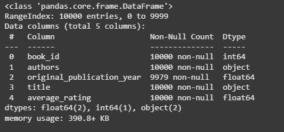
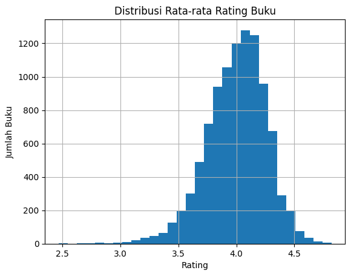

# Laporan Proyek Machine Learning - Cinta Chantika Lestari

## Project Overview
Latar belakang proyek ini berakar pada tantangan utama yang dihadapi pengguna dalam menemukan buku yang relevan di era digital, di mana jumlah koleksi buku di perpustakaan digital dan toko buku daring semakin beragam dan terus meningkat secara eksponensial. Dengan begitu banyak pilihan yang tersedia, pengguna kerap mengalami kesulitan untuk menemukan buku yang sesuai dengan minat dan preferensi pribadi mereka secara efisien [1]. Permasalahan ini tidak hanya memperlambat proses pencarian, tetapi juga dapat menurunkan kepuasan dan minat baca pengguna.

Sistem rekomendasi buku berbasis collaborative filtering hadir sebagai solusi untuk mengatasi permasalahan tersebut. Collaborative filtering memanfaatkan data interaksi pengguna, seperti riwayat penilaian dan ulasan buku, untuk mengidentifikasi pola preferensi dan memberikan rekomendasi yang dipersonalisasi. Metode ini memungkinkan sistem untuk menyarankan buku-buku yang kemungkinan besar akan disukai pengguna, berdasarkan kesamaan perilaku dan preferensi dengan pengguna lain [2]. Hal ini terbukti mampu meningkatkan relevansi rekomendasi dan memperkaya pengalaman membaca pengguna.

Pentingnya sistem rekomendasi buku yang personalisasi semakin nyata seiring dengan kebutuhan pengguna yang semakin beragam dan spesifik. Penelitian terbaru menunjukkan bahwa penerapan collaborative filtering, baik berbasis user-based maupun item-based, mampu meningkatkan akurasi rekomendasi dan mempercepat proses penemuan buku yang relevan. Selain itu, integrasi teknik machine learning seperti matrix factorization (misal: Singular Value Decomposition/SVD) dan penggunaan data besar (big data) telah terbukti efektif dalam mengatasi permasalahan skalabilitas, cold-start, serta data sparsity yang sering muncul pada sistem rekomendasi konvensional [3].

Dari hasil riset, sistem rekomendasi berbasis collaborative filtering tidak hanya meningkatkan akurasi, tetapi juga mendapat umpan balik positif dari pengguna terkait relevansi rekomendasi yang diberikan. Dengan demikian, pengembangan sistem rekomendasi buku berbasis collaborative filtering yang didukung machine learning merupakan langkah strategis untuk meningkatkan kualitas layanan perpustakaan digital dan toko buku daring, serta mendorong minat baca masyarakat secara luas.

## Business Understanding

### Problem Statements

Permasalahan yang muncul dan hendak diatasi oleh pembuatan sistem rekomendasi ini adalah sebagai berikut :
- Bagaimana cara merekomendasikan buku yang relevan untuk setiap pengguna secara personal?
- Bagaimana memastikan bahwa sistem rekomendasi memberikan saran yang akurat dan dapat dipercaya?
- Bagaimana memanfaatkan data interaksi pengguna (user-book rating) untuk membangun model prediktif?

### Goals

Menjelaskan tujuan proyek yang menjawab pernyataan masalah:
- Mengembangkan sistem rekomendasi yang mampu memberikan saran buku secara personal kepada pengguna.
- Membangun model deep learning yang dapat memprediksi tingkat kesukaan pengguna terhadap buku tertentu.
- Memanfaatkan data interaksi pengguna dan buku sebagai input untuk sistem rekomendasi.

Semua poin di atas harus diuraikan dengan jelas. Anda bebas menuliskan berapa pernyataan masalah dan juga goals yang diinginkan.

### Solution statements
Untuk mencapai tujuan-tujuan tersebut, beberapa pendekatan solusi diterapkan dan dibandingkan:

- Matrix Factorization (Baseline)
Model ini membagi matriks user-book rating menjadi representasi vektor laten pengguna dan buku. Meski sederhana dan cepat, pendekatan ini memiliki keterbatasan dalam menangkap hubungan kompleks.

- RecommenderNet (Deep Learning Approach)
Menggunakan embedding layer untuk pengguna dan buku, dikombinasikan dengan hidden layer beraktivasi ReLU. Model ini mampu mengenali pola interaksi yang lebih kompleks dan non-linear, serta terbukti memberikan RMSE yang lebih rendah dibanding baseline.

## Data Understanding

Dataset yang digunakan dalam proyek ini adalah *Goodbooks-10k Dataset*, yang tersedia secara publik di [Kaggle](https://www.kaggle.com/datasets/zygmunt/goodbooks-10k/data?select=ratings.csv). Dataset ini memuat informasi tentang lebih dari 10.000 buku beserta rating yang diberikan oleh lebih dari 53.000 pengguna, sehingga sangat cocok untuk membangun sistem rekomendasi berbasis collaborative filtering.

Dataset ini terdiri dari beberapa file penting, dua di antaranya digunakan dalam proyek ini:

1. **ratings.csv**
   File ini menyimpan data interaksi eksplisit antara pengguna dan buku dalam bentuk skor rating. Terdapat total **978.408 entri** yang mencakup **53.424 pengguna (user\_id)** dan **10.000 buku (book\_id)**. Setiap pengguna telah memberikan minimal dua rating, dengan median jumlah rating per pengguna adalah delapan. Rating berada dalam rentang 1 hingga 5.
   Variabel-variabel dalam file ini antara lain:

   * `user_id`: ID unik pengguna (rentang 1–53.424).
   * `book_id`: ID unik buku (rentang 1–10.000).
   * `rating`: Skor penilaian dari pengguna terhadap buku (1–5).

2. **books.csv**
   File ini memuat metadata dari setiap buku yang tersedia. Terdapat total 10.000 buku, masing-masing dengan informasi tambahan seperti judul, penulis, tahun terbit, dan sebagainya.
   Variabel-variabel utama:

   * `book_id`: ID unik yang mengidentifikasi buku, digunakan untuk menghubungkan dengan file ratings.
   * `title`: Judul buku.
   * `authors`: Nama penulis buku.
   * `original_publication_year`: Tahun pertama kali diterbitkan.
   * `average_rating`: Rata-rata rating yang diterima dari semua pengguna.
   * `ratings_count`: Jumlah total rating yang diterima buku.
   * `image_url`: URL gambar sampul buku.
   * `language_code`: Kode bahasa buku (jika tersedia).

Selain dua file utama di atas, dataset ini juga menyertakan file tambahan seperti:

* **to\_read.csv**: Menyimpan informasi buku-buku yang ditandai ingin dibaca oleh pengguna.
* **book\_tags.csv** dan **tags.csv**: Menyediakan informasi tag atau label yang berkaitan dengan isi/topik buku, yang dapat digunakan untuk sistem rekomendasi berbasis konten (*content-based filtering*).

Sebagian besar buku memiliki sekitar 100 ulasan, meskipun ada beberapa yang memiliki lebih sedikit. Baik `user_id` maupun `book_id` dalam dataset ini bersifat *contiguous* (berurutan dan tidak lompat-lompat), yang memudahkan proses encoding serta pemetaan kembali (*inverse mapping*) dalam sistem rekomendasi. Namun demikian, karena tidak semua pengguna memberikan rating pada semua buku, dataset ini bersifat sangat *sparse*, yang merupakan tantangan umum dalam pengembangan sistem rekomendasi.

### Exploratory Data Analysis (EDA)
Untuk memahami struktur dan kualitas data, beberapa langkah Exploratory Data Analysis (EDA) dilakukan, antara lain:
- Variabel Books
    - Mengidentifikasi bentuk dataset dan struktur
      
      Pada atribut `original_publication_year`, terdapat beberapa data yang termasuk null content. Penggunaan authors dan original_publication_year ini hanya untuk mengetahui apakah ada duplikasi data buku atau tidak, maka data dengan outlier `original_publication_year` akan dibiarkan.
    - Mengidentifikasi statistik fitur numerik untuk menentukan outlier dan perlakuan
      
      Terdapat tahun -1750 pada fitur original_publication_year, yang merupakan outlier. Namun, karena fitur ini tidak akan digunakan dalam modelling, maka diabaikan saja.
    - Memeriksa duplikasi data; Terdapat 36 buah baris duplikat judul, namun ketika dicek duplikat judul buku memang sama, namun data atribut/fitur lain berbeda.
    - Memeriksa data null; Terdapat 21 data null di original_publication_year, namun data null ini tidak perlu diatasi/dihilangkan
    - Memeriksa nilai unik book_id; sudah memiliki nilai unique yang sudah berupa integer terurut, sehingga kemungkinan tidak memerlukan proses encoding nantinya apabila nilai unik tetap.
    - Memeriksa distribusi average rating
      
      Di dataset ini, buku yang di-rating oleh pembaca kebanyakan memiliki rating di sekitar angka 4.0
      
- Variabel Rating
    -  Mengidentifikasi bentuk dataset dan struktur; Cukup terlihat bahwa tidak ada data null atau outlier, nanti akan diperiksa ulang
    -  Memeriksa duplikasi data
        ```
        Jumlah baris duplikat: 1644
        Jumlah rating duplikat (user-buku): 4487
        Jumlah kombinasi user-buku yang duplikat: 2209
        ```
        Dari hasil 2209 pasangan user-buku unik yang muncul lebih dari sekali, dan total jumlah rating-nya 4487. di atas, dapat disimpulkan bahwa ada user yang memberi rating ke buku yang sama lebih dari dua kali.   
    -  Memeriksa data null dan nilai unik rating
       
    -  Memeriksa perbedaan antara book_id di books dan rating
       
       Supaya output rekomendasi yang dihasilkan jelas dan memiliki judul buku, maka sistem rekomendasi hanya akan memanfaatkan 812 buku ini.
    -  

## Data Preparation
Pada bagian ini Anda menerapkan dan menyebutkan teknik data preparation yang dilakukan. Teknik yang digunakan pada notebook dan laporan harus berurutan.

**Rubrik/Kriteria Tambahan (Opsional)**: 
- Menjelaskan proses data preparation yang dilakukan
- Menjelaskan alasan mengapa diperlukan tahapan data preparation tersebut.

## Modeling
Tahapan ini membahas mengenai model sisten rekomendasi yang Anda buat untuk menyelesaikan permasalahan. Sajikan top-N recommendation sebagai output.

**Rubrik/Kriteria Tambahan (Opsional)**: 
- Menyajikan dua solusi rekomendasi dengan algoritma yang berbeda.
- Menjelaskan kelebihan dan kekurangan dari solusi/pendekatan yang dipilih.

## Evaluation
Pada bagian ini Anda perlu menyebutkan metrik evaluasi yang digunakan. Kemudian, jelaskan hasil proyek berdasarkan metrik evaluasi tersebut.

Ingatlah, metrik evaluasi yang digunakan harus sesuai dengan konteks data, problem statement, dan solusi yang diinginkan.

**Rubrik/Kriteria Tambahan (Opsional)**: 
- Menjelaskan formula metrik dan bagaimana metrik tersebut bekerja.

**---Ini adalah bagian akhir laporan---**

_Catatan:_
- _Anda dapat menambahkan gambar, kode, atau tabel ke dalam laporan jika diperlukan. Temukan caranya pada contoh dokumen markdown di situs editor [Dillinger](https://dillinger.io/), [Github Guides: Mastering markdown](https://guides.github.com/features/mastering-markdown/), atau sumber lain di internet. Semangat!_
- Jika terdapat penjelasan yang harus menyertakan code snippet, tuliskan dengan sewajarnya. Tidak perlu menuliskan keseluruhan kode project, cukup bagian yang ingin dijelaskan saja.

## Referensi
[1] Onkar A. More, Shubham S. Kore, Kabir G. Kharade. "Book Recommendation System using Machine Learning," International Journal on Advanced Computer Theory and Engineering, vol. 14, no. 1, pp. 60–65, 2025. [Online]. Tersedia: journals.mriindia.com
[2] Sutan Abeng Pratama. (2025). Development Of A Book Recommendation System Using Collaborative Filtering. Jurnal Komputer, 2(2), 81–86. https://doi.org/10.70963/jk.v2i2.112 
[3] Akhila Miriyala, Pranitha Chikondra, Sarayu Alwala, Nadia Anjum. (2025). Book Recommendation System Using Collaborative Filtering. International Journal Of Novel Research And Development, 10(3). 
