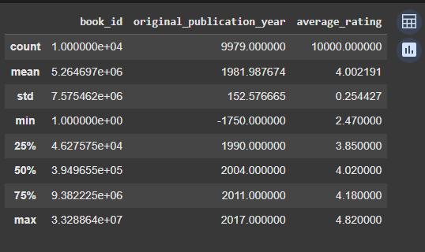

# Laporan Proyek Machine Learning - Cinta Chantika Lestari

## Project Overview
Latar belakang proyek ini berakar pada tantangan utama yang dihadapi pengguna dalam menemukan buku yang relevan di era digital, di mana jumlah koleksi buku di perpustakaan digital dan toko buku daring semakin beragam dan terus meningkat secara eksponensial. Dengan begitu banyak pilihan yang tersedia, pengguna kerap mengalami kesulitan untuk menemukan buku yang sesuai dengan minat dan preferensi pribadi mereka secara efisien [1]. Permasalahan ini tidak hanya memperlambat proses pencarian, tetapi juga dapat menurunkan kepuasan dan minat baca pengguna.

Sistem rekomendasi buku berbasis collaborative filtering hadir sebagai solusi untuk mengatasi permasalahan tersebut. Collaborative filtering memanfaatkan data interaksi pengguna, seperti riwayat penilaian dan ulasan buku, untuk mengidentifikasi pola preferensi dan memberikan rekomendasi yang dipersonalisasi. Metode ini memungkinkan sistem untuk menyarankan buku-buku yang kemungkinan besar akan disukai pengguna, berdasarkan kesamaan perilaku dan preferensi dengan pengguna lain [2]. Hal ini terbukti mampu meningkatkan relevansi rekomendasi dan memperkaya pengalaman membaca pengguna.

Pentingnya sistem rekomendasi buku yang personalisasi semakin nyata seiring dengan kebutuhan pengguna yang semakin beragam dan spesifik. Penelitian terbaru menunjukkan bahwa penerapan collaborative filtering, baik berbasis user-based maupun item-based, mampu meningkatkan akurasi rekomendasi dan mempercepat proses penemuan buku yang relevan. Selain itu, integrasi teknik machine learning seperti matrix factorization (misal: Singular Value Decomposition/SVD) dan penggunaan data besar (big data) telah terbukti efektif dalam mengatasi permasalahan skalabilitas, cold-start, serta data sparsity yang sering muncul pada sistem rekomendasi konvensional [3].

Dari hasil riset, sistem rekomendasi berbasis collaborative filtering tidak hanya meningkatkan akurasi, tetapi juga mendapat umpan balik positif dari pengguna terkait relevansi rekomendasi yang diberikan. Dengan demikian, pengembangan sistem rekomendasi buku berbasis collaborative filtering yang didukung machine learning merupakan langkah strategis untuk meningkatkan kualitas layanan perpustakaan digital dan toko buku daring, serta mendorong minat baca masyarakat secara luas.

## Business Understanding

### Problem Statements

Permasalahan yang muncul dan hendak diatasi oleh pembuatan sistem rekomendasi ini adalah sebagai berikut :
- Bagaimana cara merekomendasikan buku yang relevan untuk setiap pengguna secara personal?
- Bagaimana memastikan bahwa sistem rekomendasi memberikan saran yang akurat dan dapat dipercaya?
- Bagaimana memanfaatkan data interaksi pengguna (user-book rating) untuk membangun model prediktif?

### Goals

Menjelaskan tujuan proyek yang menjawab pernyataan masalah:
- Mengembangkan sistem rekomendasi yang mampu memberikan saran buku secara personal kepada pengguna.
- Membangun model deep learning yang dapat memprediksi tingkat kesukaan pengguna terhadap buku tertentu.
- Memanfaatkan data interaksi pengguna dan buku sebagai input untuk sistem rekomendasi.

Semua poin di atas harus diuraikan dengan jelas. Anda bebas menuliskan berapa pernyataan masalah dan juga goals yang diinginkan.

### Solution statements
Untuk mencapai tujuan-tujuan tersebut, beberapa pendekatan solusi diterapkan dan dibandingkan:

- Matrix Factorization (Baseline)
Model ini membagi matriks user-book rating menjadi representasi vektor laten pengguna dan buku. Meski sederhana dan cepat, pendekatan ini memiliki keterbatasan dalam menangkap hubungan kompleks.

- RecommenderNet (Deep Learning Approach)
Menggunakan embedding layer untuk pengguna dan buku, dikombinasikan dengan hidden layer beraktivasi ReLU. Model ini mampu mengenali pola interaksi yang lebih kompleks dan non-linear, serta terbukti memberikan RMSE yang lebih rendah dibanding baseline.

## Data Understanding

Dataset yang digunakan dalam proyek ini adalah *Goodbooks-10k Dataset*, yang tersedia secara publik di [Kaggle](https://www.kaggle.com/datasets/zygmunt/goodbooks-10k/data?select=ratings.csv). Dataset ini memuat informasi tentang lebih dari 10.000 buku beserta rating yang diberikan oleh lebih dari 53.000 pengguna, sehingga sangat cocok untuk membangun sistem rekomendasi berbasis collaborative filtering.

Dataset ini terdiri dari beberapa file penting, dua di antaranya digunakan dalam proyek ini:

1. **ratings.csv**
   File ini menyimpan data interaksi eksplisit antara pengguna dan buku dalam bentuk skor rating. Terdapat total **978.408 entri** yang mencakup **53.424 pengguna (user\_id)** dan **10.000 buku (book\_id)**. Setiap pengguna telah memberikan minimal dua rating, dengan median jumlah rating per pengguna adalah delapan. Rating berada dalam rentang 1 hingga 5.
   Variabel-variabel dalam file ini antara lain:

   * `user_id`: ID unik pengguna (rentang 1–53.424).
   * `book_id`: ID unik buku (rentang 1–10.000).
   * `rating`: Skor penilaian dari pengguna terhadap buku (1–5).

2. **books.csv**
   File ini memuat metadata dari setiap buku yang tersedia. Terdapat total 10.000 buku, masing-masing dengan informasi tambahan seperti judul, penulis, tahun terbit, dan sebagainya.
   Variabel-variabel utama:

   * `book_id`: ID unik yang mengidentifikasi buku, digunakan untuk menghubungkan dengan file ratings.
   * `title`: Judul buku.
   * `authors`: Nama penulis buku.
   * `original_publication_year`: Tahun pertama kali diterbitkan.
   * `average_rating`: Rata-rata rating yang diterima dari semua pengguna.
   * `ratings_count`: Jumlah total rating yang diterima buku.
   * `image_url`: URL gambar sampul buku.
   * `language_code`: Kode bahasa buku (jika tersedia).

Selain dua file utama di atas, dataset ini juga menyertakan file tambahan seperti:

* **to\_read.csv**: Menyimpan informasi buku-buku yang ditandai ingin dibaca oleh pengguna.
* **book\_tags.csv** dan **tags.csv**: Menyediakan informasi tag atau label yang berkaitan dengan isi/topik buku, yang dapat digunakan untuk sistem rekomendasi berbasis konten (*content-based filtering*).

Sebagian besar buku memiliki sekitar 100 ulasan, meskipun ada beberapa yang memiliki lebih sedikit. Baik `user_id` maupun `book_id` dalam dataset ini bersifat *contiguous* (berurutan dan tidak lompat-lompat), yang memudahkan proses encoding serta pemetaan kembali (*inverse mapping*) dalam sistem rekomendasi. Namun demikian, karena tidak semua pengguna memberikan rating pada semua buku, dataset ini bersifat sangat *sparse*, yang merupakan tantangan umum dalam pengembangan sistem rekomendasi.

### Exploratory Data Analysis (EDA)
Untuk memahami struktur dan kualitas data, beberapa langkah Exploratory Data Analysis (EDA) dilakukan, antara lain:
- Variabel Books
    - Mengidentifikasi bentuk dataset dan struktur
      
      
      
      Pada atribut `original_publication_year`, terdapat beberapa data yang termasuk null content. Penggunaan authors dan original_publication_year ini hanya untuk mengetahui apakah ada duplikasi data buku atau tidak, maka data dengan outlier `original_publication_year` akan dibiarkan.
    - Mengidentifikasi statistik fitur numerik untuk menentukan outlier dan perlakuan
      
      
      Terdapat tahun -1750 pada fitur original_publication_year, yang merupakan outlier. Namun, karena fitur ini tidak akan digunakan dalam modelling, maka diabaikan saja.
    - Memeriksa duplikasi data; Terdapat 36 buah baris duplikat judul, namun ketika dicek duplikat judul buku memang sama, namun data atribut/fitur lain berbeda.
    - Memeriksa data null; Terdapat 21 data null di `original_publication_year`, namun data null ini tidak perlu diatasi/dihilangkan
    - Memeriksa nilai unik `book_id`; Sudah memiliki nilai unique yang sudah berupa integer terurut, sehingga kemungkinan tidak memerlukan proses encoding nantinya apabila nilai unik tetap.
    - Visualisasi distribusi average rating
      
      
      
      Di dataset ini, buku yang di-rating oleh pembaca kebanyakan memiliki rating di sekitar angka 4.0
      
- Variabel Rating
    -  Mengidentifikasi bentuk dataset dan struktur; Cukup terlihat bahwa tidak ada data null atau outlier, nanti akan diperiksa ulang.
    -  Memeriksa duplikasi data
        ```
        Jumlah baris duplikat: 1644
        Jumlah rating duplikat (user-buku): 4487
        Jumlah kombinasi user-buku yang duplikat: 2209
        ```
        Dari hasil 2209 pasangan user-buku unik yang muncul lebih dari sekali, dan total jumlah rating-nya 4487. di atas, dapat disimpulkan bahwa ada user yang memberi rating ke buku yang sama lebih dari dua kali.   
    -  Memeriksa data null dan nilai unik rating
      
       
       
    -  Memeriksa perbedaan antara book_id di books dan rating
      
       
       
       Supaya output rekomendasi yang dihasilkan jelas dan memiliki judul buku, maka sistem rekomendasi hanya akan memanfaatkan 812 buku ini.
    -  Memeriksa apabila nilai unique sudah urut atau memerlukan encoding
      
       
       
       Walaupun id unique sudah berurutan, hanya 812 buku yang akan digunakan. Ada kemungkinan ID tidak akan terurut lagi (terdapat angka urutan yang terlompat)
    -  Visualisasi distribusi rating
      
       
       
       Mayoritas rating yang diberikan oleh pengguna berada pada rentang 3 hingga 5, dengan rating 4 yang mendominasi
    -  Visualisasi distribusi rating per user
      
       
       
       Banyak pengguna hanya memberikan beberapa rating, dengan sebagian besar berada di sisi kiri grafik, menandakan bahwa ada banyak pengguna yang hanya memberikan rating untuk beberapa buku saja.
    -  Visualisasi distribusi rating per buku
      
       
       
       Banyak buku mendapatkan rating yang cukup banyak, dengan buku yang mendapat 100 rating menjadi kelompok terbesar.

## Data Preparation
Teknik data preparation atau preprocessing yang dilakukan adalah:
- Variabel Books
   - Menghilangkan fitur original_publication_year, average_rating, dan authors karena tidak relevan untuk pembuatan model Collaborative Filtering. Menyisakan fitur `book_id` dan `title`
   - Menyimpan mapping untuk memanggil title nantinya saat inference
     ```
     book_id_to_title = dict(zip(books['book_id'], books['title']))
      ```
- Variabel Rating
   - Mengatasi data duplikat, tepatnya pada user yang memberi rating ke buku yang sama lebih dari sekali. Untuk menghindari bias dalam representasi preferensi
- Melakukan _merge_ (_inner join_) antara `books` dan `rating` agar hanya buku yang memiliki informasi judul (title) dan telah diberi rating oleh pengguna yang diproses oleh model, sehingga hasil rekomendasi bisa ditampilkan secara lengkap dan relevan.
- Encoding `user_id` dan `book_id`, ini diperlukan agar ID bersifat contiguous (berurutan dari 0) dan cocok digunakan dalam embedding layer model deep learning, karena layer ini hanya menerima integer index, serta menjaga agar memori tetap efisien.
- Splitting data menjadi test dan train wajib dilakukan sebelum melakukan pemodelan serta train model.
- Scaling/standarisasi data supaya fitur numerik lebih stabil dan loss nantinya bisa terkontrol dan menghindari overfit

## Modeling
Pada tahap ini dikembangkan dua pendekatan sistem rekomendasi _collaborative filtering_ dengan algoritma yang berbeda, yaitu Matrix Factorization (menggunakan metode SVD) dan RecommenderNet (berbasis deep learning). Keduanya dirancang untuk memprediksi rating buku oleh pengguna dan menghasilkan Top-N rekomendasi yang dipersonalisasi sebagai berikut:
Top-N rekomendasi menggunakan SVD:


Top-N rekomendasi menggunakan RecommenderNet:


Model Matrix Factorization bekerja dengan merepresentasikan pengguna dan item sebagai vektor embedding yang kemudian dikalikan untuk menghasilkan prediksi rating. Model ini cukup sederhana, efisien, dan cepat dalam proses pelatihan, serta cocok digunakan sebagai baseline karena performanya yang cukup stabil di data dengan pola linier. Hasil rekomendasinya pun terlihat tajam, meskipun cenderung ekstrem akibat aktivasi sigmoid yang mendorong prediksi ke nilai mendekati 0 atau 1. Kekurangan utama model ini adalah keterbatasannya dalam menangkap hubungan kompleks antara pengguna dan item.

Sementara itu, RecommenderNet menggunakan pendekatan neural network yang memungkinkan model belajar dari pola non-linear dalam data. Model ini menunjukkan hasil prediksi yang lebih halus dan realistis dibanding SVD, serta lebih fleksibel dalam menangani data dengan variasi interaksi pengguna yang tinggi. Namun, model ini berpotensi mengalami underfitting jika arsitekturnya terlalu sederhana atau pelatihan belum optimal. Waktu pelatihan juga relatif lebih lama dibanding model matrix factorization.

Kedua model berhasil memberikan rekomendasi buku terbaik untuk pengguna secara personal. Pemilihan pendekatan tergantung pada kebutuhan, yakni SVD cocok untuk baseline cepat dan sederhana, sementara RecommenderNet lebih cocok untuk prediksi yang lebih dalam dan kompleks, selama proses tuning dilakukan dengan tepat.

## Evaluation

### Metrik Evaluasi: RMSE

Untuk mengevaluasi performa sistem rekomendasi, digunakan metrik **Root Mean Squared Error (RMSE)**, yang mengukur rata-rata akar kuadrat dari selisih antara rating aktual dengan rating yang diprediksi. RMSE dipilih karena mampu memberikan penalti lebih besar terhadap kesalahan prediksi yang ekstrem, sehingga cocok untuk mengevaluasi akurasi prediksi dalam sistem rekomendasi berbasis rating. Secara matematis, RMSE dirumuskan sebagai:

$$
\text{RMSE} = \sqrt{ \frac{1}{n} \sum_{i=1}^{n} (y_i - \hat{y}_i)^2 }
$$

di mana $y_i$ adalah rating aktual, $\hat{y}_i$ adalah rating hasil prediksi, dan $n$ adalah jumlah sampel.

### Hasil Evaluasi Model

Berdasarkan hasil pelatihan dan pengujian:

```
===== Perbandingan Model =====
Matrix Factorization RMSE:  0.5531
RecommenderNet RMSE:        0.1904
```

Model **RecommenderNet** menghasilkan nilai RMSE yang jauh lebih rendah dibandingkan Matrix Factorization. Ini menunjukkan bahwa model deep learning ini memiliki kemampuan prediksi yang lebih akurat terhadap preferensi pengguna.


Performa ini juga tercermin dari **learning curve** RecommenderNet. Grafik menunjukkan penurunan tajam pada train loss di awal pelatihan dan kestabilan pada train maupun validation loss setelah beberapa epoch, menandakan model cepat konvergen dan tidak mengalami overfitting. Validation loss dan RMSE cenderung lebih rendah dibandingkan data latih, mengindikasikan generalisasi model yang sangat baik. Dengan performa validasi yang konsisten dan RMSE rendah, RecommenderNet terbukti lebih andal sebagai solusi sistem rekomendasi pada proyek ini.

## Referensi
[1] Onkar A. More, Shubham S. Kore, Kabir G. Kharade. "Book Recommendation System using Machine Learning," International Journal on Advanced Computer Theory and Engineering, vol. 14, no. 1, pp. 60–65, 2025. [Online]. Tersedia: journals.mriindia.com

[2] Sutan Abeng Pratama. (2025). Development Of A Book Recommendation System Using Collaborative Filtering. Jurnal Komputer, 2(2), 81–86. https://doi.org/10.70963/jk.v2i2.112 

[3] Akhila Miriyala, Pranitha Chikondra, Sarayu Alwala, Nadia Anjum. (2025). Book Recommendation System Using Collaborative Filtering. International Journal Of Novel Research And Development, 10(3). 
